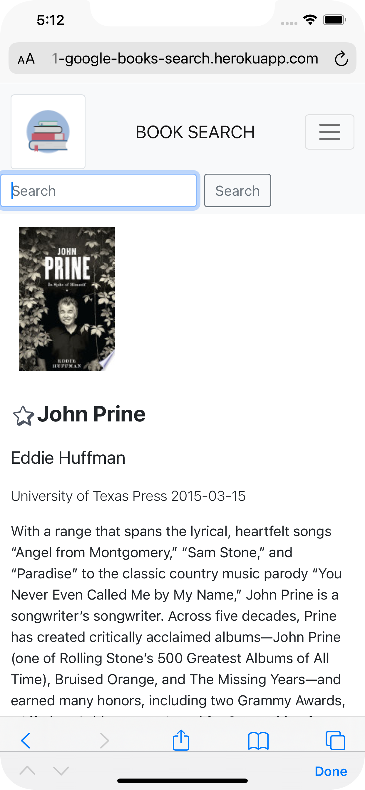
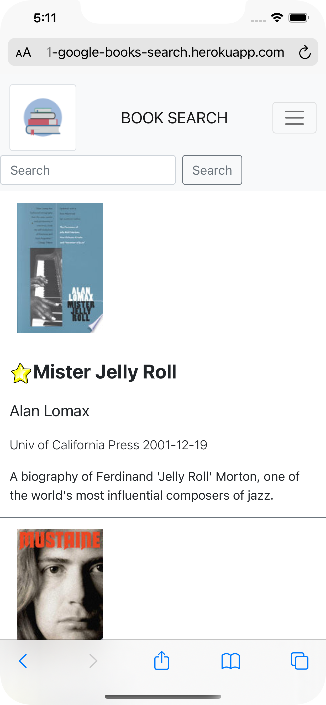
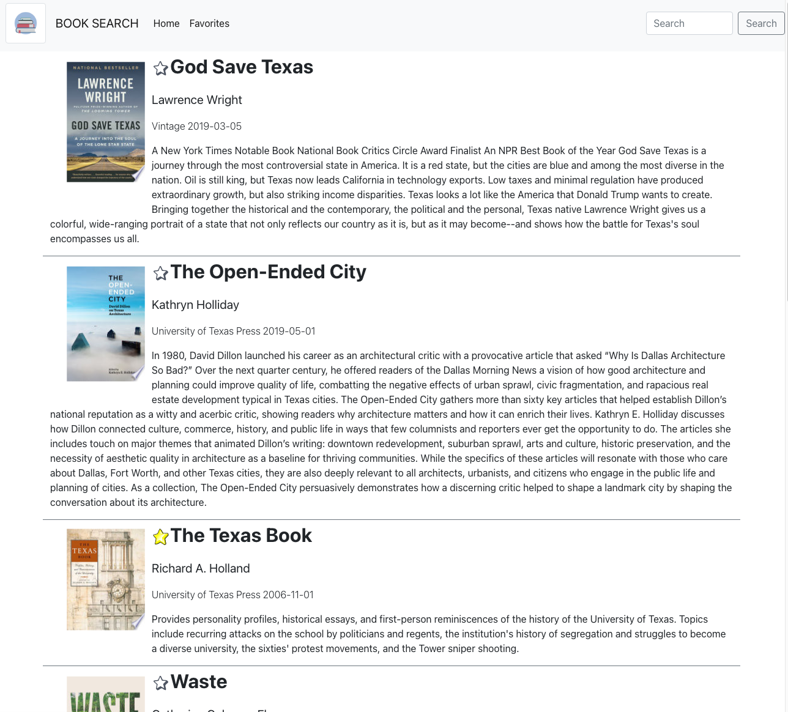
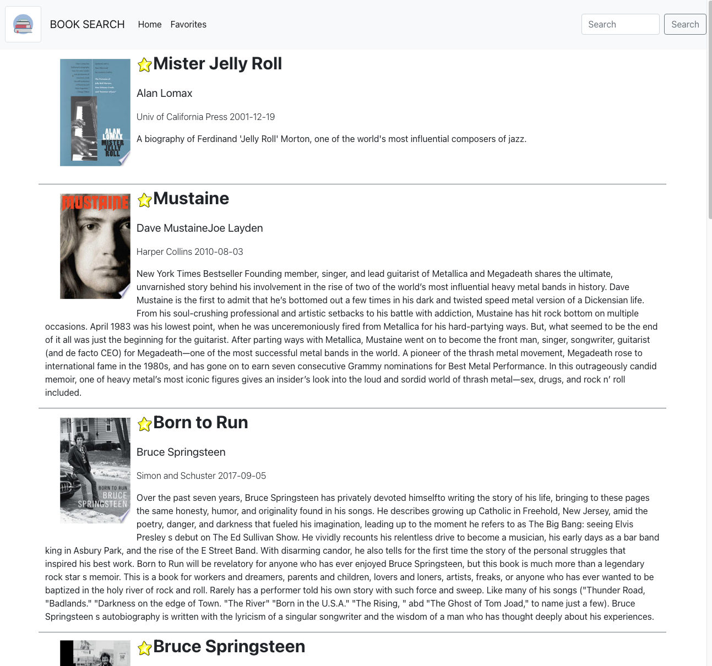

 
# Project name : Book Search
## Live project site can be acces here: 	[Book Search](https://hw21-google-books-search.herokuapp.com/)

## Project Repo [Book Search](https://github.com/trilambda122/googlebooks-search)

---
## Table of Contents

[Description](#description)...

[Installation Requirements](#installtion-requirments)...

[Useage](#useage)...

[License](#License)...

[Contribitors](#Contribitors)...

[Tests](#Tests)...

[Questions](#Questions)...

[Application Screen Shots](#ScreenShots)...

---
## Description
Have you ever been wanting to read a book but at a loss for what to read! This reading list application allows you to search and review books then add them to your favorites list. You will never have to wonder what to read next!

The application utilizes MongoDB for the backend database and React for client-side rendering. Along with Bootstrap and customer CSS for styling
Application allowing the user to search  google's open book API and saves individual books to a database for long term storage

Some accomplishments in this project 
1) Project uses function react components 
2) Project uses global state and context hooks 
3) Text descriptions freely wrap-around book images in the list 
4) Has multiple errors pages 
5) Has various error and conditional checks to work around issues with the google API 

---

## Installtion requirments
Currently deployed on heroku. 
Follow standard proceedures for installing React-Express apllciations on your platform of choice 

---
## Useage
In the project directory, you can run:

### `npm run dev`

Runs the app in the development mode.\
Open [http://localhost:3000](http://localhost:3000) to view it in the browser.

---
## License
NOTICE This application is covered under MIT License license.

---
## Contribitors 

Shane Schilling

---
## Tests
None at this time 

---
## Questions

Github profile can be found here:  http://github.com/trilambda122

Please direct any additonal questions to: shane@sschilling.com

---
## ScreenShots

### *MOBILE*

### *WEB PAGE*

